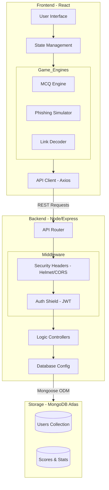

# Hackademy      

A comprehensive cybersecurity education platform that transforms learning into an engaging game experience. Learn about real-world cyber threats through interactive quizzes, detailed scam guides and compete on a global leaderboard.
---

##  Key Features

###  **Interactive Learning Experience**
- **Real-world Scenarios** - Learn through actual cyber threat examples
- **Diverse Game Modules** - Multi-format games including Phishing simulation and Link Decoding
- **Gamified Quizzes** - Earn points and climb the global leaderboard
- **Instant Feedback** - Learn from mistakes with high-performance animations and explanations
- **Progress Tracking** - Monitor your cybersecurity knowledge across different modules

###  **Comprehensive Scam Education**
- **Digital Arrest Scams** - Learn to identify and avoid fake police calls
- **UPI Payment Scams** - Understand common UPI fraud techniques
- **E-KYC SIM Swap** - Protect yourself from identity theft
- **Fake Job Scams** - Recognize fraudulent employment offers
- **WhatsApp Stock Scams** - Avoid investment fraud on messaging platforms

###  **Competitive Elements**
- **Global Leaderboard** - Compete with players worldwide
- **Real-time Scoring** - Points awarded instantly for correct answers
- **User Statistics** - Track your performance and improvement
- **No Registration Required** - Just enter a username and start playing

###  **Modern User Experience**
- **Responsive Design** - Fixed-viewport mobile layout with zero horizontal overflow
- **Minimalist UI** - SaaS-style minimalist Navbar with contextual mobile actions
- **High Performance** - Optimized animations using Framer Motion and smooth transitions
- **Accessibility** - Designed with clear visual hierarchy and intuitive hit targets

---

##  Technical Architecture

### **System Architecture Flow**



### **Core Stack**
- **Frontend**: React 18, CSS Modules, Framer Motion, Lucide Icons
- **Backend**: Node.js, Express.js (RESTful API)
- **Database**: MongoDB Atlas (Cloud)
- **Security**: JWT-based session persistence, Bcrypt password hashing
- **Deployment**: Render (Static Site + Web Service)

### **Implementation Details**
- **Zero-Overflow Responsive Engine**: Specialized CSS architecture using relative units and transform-based animations to eliminate horizontal scroll bugs on mobile.
- **Stateless Authentication**: Uses non-sensitive local storage identifiers synced with server-side validation for a seamless "just-in username" login experience.
- **Dynamic Content Loading**: Modular page architecture allowing for instant switching between interactive simulations (MCQ, Phishing, Link Decoding) without full page reloads.


---

##  Project Structure
```
hackademyfinal/
├── client/                    # React Frontend
│   ├── public/
│   │   ├── images/           # Scam scenario images
│   │   ├── index.html
│   │   └── favicon.ico
│   ├── src/
│   │   ├── components/       # Reusable UI components
│   │   │   ├── Navbar.js
│   │   │   └── LeaderboardItem.js
│   │   ├── pages/           # Main application pages
│   │   │   ├── LandingPage.js
│   │   │   ├── UsernamePage.js
│   │   │   ├── MCQGamePage.js
│   │   │   ├── PhishingGamePage.js
│   │   │   ├── LinkDecoderGamePage.js
│   │   │   ├── GamesHubPage.js
│   │   │   ├── LeaderboardPage.js
│   │   │   ├── LearnPage.js
│   │   │   ├── DigitalArrestScamPage.js
│   │   │   ├── UPIScamPage.js
│   │   │   ├── EKYCPage.js
│   │   │   ├── FakeJobScamPage.js
│   │   │   └── WhatsAppStockScam.js
│   │   ├── styles/          # CSS modules (optimized for zero-overflow)
│   │   ├── utils/           # API and security utilities
│   │   └── App.js           # Main Entry Point with Route-based navigation
│   └── package.json
├── server/                   # Express Backend
│   ├── config/
│   │   └── db.js            # Database configuration
│   ├── controllers/
│   │   └── userController.js # Business logic
│   ├── models/
│   │   └── User.js          # MongoDB schemas
│   ├── routes/
│   │   └── userRoutes.js    # API endpoints
│   ├── server.js            # Entry point
│   └── package.json
└── README.md
```

---

##  Prerequisites

Before you begin, ensure you have the following installed:
- **Node.js** (v16 or higher) - [Download here](https://nodejs.org)  
- **npm** (comes with Node.js)  
- **MongoDB Atlas Account** - [Sign up here](https://www.mongodb.com/atlas)  
- **Git** - [Download here](https://git-scm.com)  

---

##  Quick Start

### 1. Clone the Repository
```bash
git clone https://github.com/your-username/hackademyfinal.git
cd hackademyfinal
```

### 2. Backend Setup
```bash
# Navigate to server directory
cd server

# Install dependencies
npm install

# Create environment file
cp .env.example .env
# Edit .env with your MongoDB connection string

# Start the backend server
npm run dev
```
The backend will run on: **http://localhost:5000**

### 3. Frontend Setup
```bash
# Navigate to client directory (new terminal)
cd client

# Install dependencies
npm install

# Start the React app
npm start
```
The frontend will run on: **http://localhost:3000**

### 4. Environment Configuration

Create a `.env` file in the `server/` directory with the following variables:
```env
PORT=5000
MONGODB_URI=your_mongodb_connection_string_here
NODE_ENV=development

```


---

##  API Endpoints

| Method | Endpoint              | Description              | Request Body |
|--------|-----------------------|--------------------------|--------------|
| `GET`  | `/`                   | API health check         | - |
| `POST` | `/api/user`           | Create new user          | `{ "username": "string" }` |
| `GET`  | `/api/user/:username` | Get user by username     | - |
| `POST` | `/api/score`          | Update user score        | `{ "username": "string", "scoreToAdd": number }` |
| `GET`  | `/api/leaderboard`    | Get top players          | Query: `?limit=50` |
| `GET`  | `/api/stats`          | Get platform statistics  | - |

---

##  Technology Stack

### Backend Dependencies
- **express** (^5.1.0) - Fast, minimalist web framework for Node.js  
- **mongoose** (^8.18.0) - MongoDB object modeling for Node.js  
- **cors** (^2.8.5) - Enables cross-origin resource sharing  
- **dotenv** (^17.2.2) - Loads environment variables from a `.env` file  
- **bcryptjs** (^3.0.2) - Secure password hashing  
- **jsonwebtoken** (^9.0.2) - Token-based authentication  
- **colors** (^1.4.0) - Adds colors to console output  

**Dev Dependencies:**  
- **nodemon** (^3.1.10) - Automatically restarts the server during development  

### Frontend Dependencies
- **react** (^18.2.0) - Core React library  
- **react-dom** (^18.2.0) - Renders React components  
- **react-router-dom** (^6.8.0) - Client-side routing  
- **axios** (^1.3.0) - HTTP client for API requests  
- **framer-motion** (^12.34.2) - Production-ready motion library  
- **react-simple-typewriter** (^5.0.1) - Typewriter effect for cyber aesthetics  
- **chart.js** (^4.5.1) - Data visualization  
- **react-chartjs-2** (^5.3.0) - React wrapper for Chart.js  
- **lucide-react** (^0.546.0) - Icon library  
- **react-scripts** (5.0.1) - Configuration and scripts for CRA  

---

###  Server : [https://hackademy.onrender.com](https://hackademy.onrender.com)


