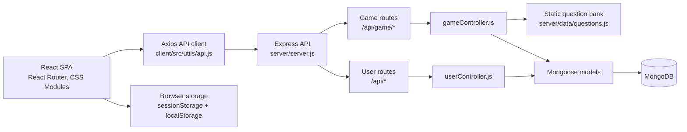
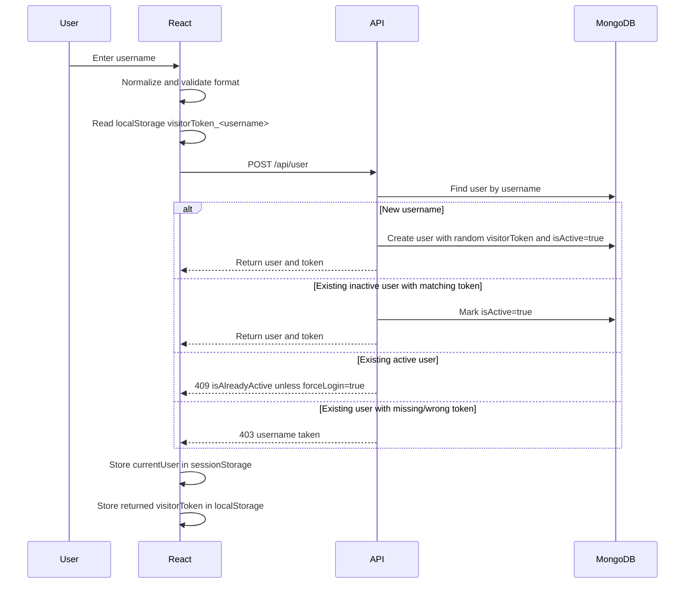
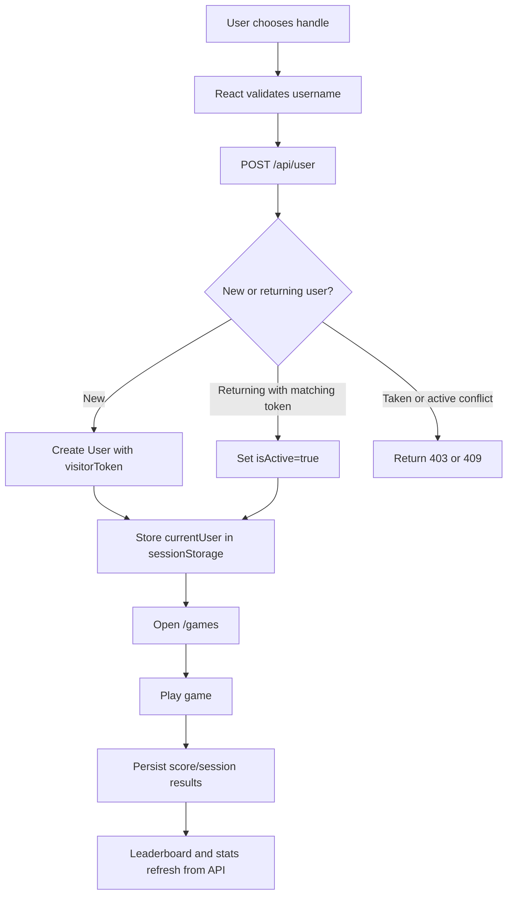
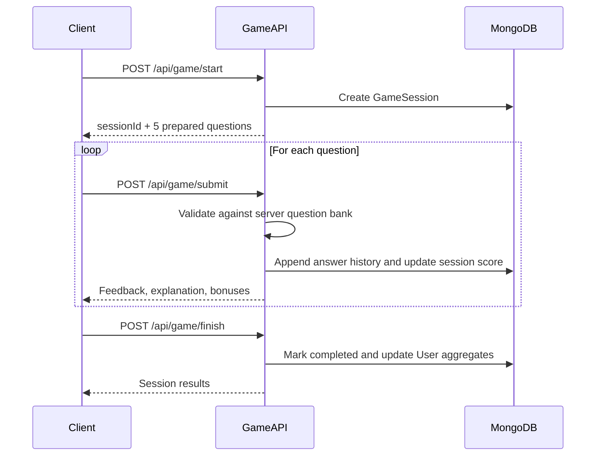

# Hackademy

Hackademy is a full-stack cybersecurity learning platform that teaches common digital fraud patterns through short learning modules, interactive scam simulations, and a public leaderboard. The application focuses on practical threat recognition for Indian users, including UPI fraud, digital arrest scams, SIM-swap/e-KYC abuse, fake job offers, WhatsApp or Telegram investment scams, phishing messages and malicious lookalike links.

The repository is a MERN-style application with a React client, an Express API, and MongoDB persistence through Mongoose. The experience is intentionally low-friction: users choose a public handle, play training games, and compete by best scores rather than creating password-based accounts.


## Table of Contents

- [Features](#features)
- [Architecture](#architecture)
- [Technology Stack](#technology-stack)
- [Project Structure](#project-structure)
- [Frontend](#frontend)
- [Backend](#backend)
- [Authentication and Session Model](#authentication-and-session-model)
- [Database Design](#database-design)
- [Game Engine and Scoring](#game-engine-and-scoring)
- [Learning Modules](#learning-modules)
- [API Reference](#api-reference)
- [Data Flow](#data-flow)
- [Security Practices](#security-practices)
- [Environment Variables](#environment-variables)
- [Local Development](#local-development)
- [Deployment](#deployment)
- [Testing and Quality Notes](#testing-and-quality-notes)

## Features

- Handle-based user identity with server-side uniqueness checks.
- Returning-user recovery through a per-username visitor token stored in the browser.
- Three training games:
  - Knowledge Check: server-backed quiz sessions with shuffled questions, server-side answer validation, timers, difficulty multipliers, time bonuses, and streak bonuses.
  - Phishing Simulator: client-side SMS/email scenario classification with best-score persistence.
  - Link Decoder: client-side lookalike-domain recognition with best-score persistence.
- Public leaderboard sorted by score and recent activity.
- Platform statistics for total users, games, score, analyzed questions, accuracy, active users, and top player.
- Five static learning modules with visual content and browser text-to-speech support.
- React Router single-page app with responsive navigation and Vercel rewrite support.
- Express API with MongoDB persistence and CORS origin allow-listing.

## Architecture



The platform is split into two separately installed Node projects:

| Layer | Location | Responsibility |
| --- | --- | --- |
| Client | `client/` | React SPA, routing, game UI, learning pages, API calls, browser-side session state |
| Server | `server/` | Express API, CORS configuration, MongoDB connection, user persistence, leaderboard data, server-backed quiz sessions |
| Database | MongoDB via `MONGODB_URI` | Stores users and Knowledge Check game sessions |

## Technology Stack

### Client

| Dependency | Purpose |
| --- | --- |
| `react`, `react-dom` | UI rendering |
| `react-router-dom` | Client-side routing |
| `axios` | REST API client |
| `lucide-react` | Icons |
| `recharts` | Leaderboard charts |
| `chart.js`, `react-chartjs-2` | Installed charting dependencies |
| `framer-motion` | Installed animation dependency |
| `react-simple-typewriter` | Typewriter-style visual effects through `CyberText` |
| `react-scripts` | Create React App build tooling |

### Server

| Dependency | Purpose |
| --- | --- |
| `express` | REST API server |
| `mongoose` | MongoDB object modeling |
| `cors` | Cross-origin request policy |
| `dotenv` | Environment variable loading |
| `colors` | Colored server logs |
| `nodemon` | Development auto-restart |
| `bcryptjs`, `jsonwebtoken` | Installed but not used by the current authentication flow |

## Project Structure

```text
hackademyfinal/
|-- client/
|   |-- public/
|   |   |-- images/                 # Static images used by learning modules
|   |   |-- favicon.ico
|   |   `-- index.html
|   |-- src/
|   |   |-- components/
|   |   |   |-- CyberText.js
|   |   |   |-- DefenseProtocol.js
|   |   |   |-- LeaderboardItem.js
|   |   |   `-- Navbar.js
|   |   |-- pages/
|   |   |   |-- LandingPage.js
|   |   |   |-- UsernamePage.js
|   |   |   |-- GamesHubPage.js
|   |   |   |-- MCQGamePage.js
|   |   |   |-- PhishingGamePage.js
|   |   |   |-- LinkDecoderGamePage.js
|   |   |   |-- LeaderboardPage.js
|   |   |   |-- LearnPage.js
|   |   |   |-- DigitalArrestScamPage.js
|   |   |   |-- UPIScamPage.js
|   |   |   |-- EKYCPage.js
|   |   |   |-- FakeJobScamPage.js
|   |   |   `-- WhatsAppStockScam.js
|   |   |-- styles/                  # CSS Modules and shared CSS
|   |   |-- utils/
|   |   |   `-- api.js                # Axios API wrappers
|   |   |-- App.js                    # Routes and browser session lifecycle
|   |   `-- index.js
|   |-- package.json
|   `-- vercel.json                  # SPA fallback rewrite
|-- server/
|   |-- config/
|   |   `-- db.js                     # MongoDB connection
|   |-- controllers/
|   |   |-- gameController.js
|   |   `-- userController.js
|   |-- data/
|   |   `-- questions.js              # Server-side MCQ question bank
|   |-- models/
|   |   |-- GameSession.js
|   |   `-- User.js
|   |-- routes/
|   |   |-- gameRoutes.js
|   |   `-- userRoutes.js
|   |-- package.json
|   `-- server.js
|-- .gitignore
|-- PROJECT_SUMMARY.md
`-- readme.md
```

## Frontend

The frontend is a Create React App single-page application. `App.js` defines the route table and owns the current-user state. The application stores the active handle in `sessionStorage`, which means a user remains logged in for the browser session but is cleared when the session ends. A separate returning-user token is stored in `localStorage` under `visitorToken_<username>` so the same browser can reclaim a handle later.

### Main Routes

| Route | Component | Purpose |
| --- | --- | --- |
| `/` | `LandingPage` | Product landing experience with module links and animated dashboard preview |
| `/username` | `UsernamePage` | Handle selection, validation, and returning-token login |
| `/games` | `GamesHubPage` | Arcade hub for all game modes |
| `/game` | `MCQGamePage` | Server-backed Knowledge Check |
| `/phishing-game` | `PhishingGamePage` | Client-side phishing classification game |
| `/link-decoder` | `LinkDecoderGamePage` | Client-side URL recognition game |
| `/leaderboard` | `LeaderboardPage` | Charts, stats, ranking list, and current-user rank |
| `/learn` | `LearnPage` | Learning module index |
| `/learn/digital-arrest-scam` | `DigitalArrestScamPage` | Static article with read-aloud support |
| `/learn/upi-payment-scams` | `UPIScamPage` | Static article with read-aloud support |
| `/learn/ekyc-sim-swap` | `EKYCPage` | Static article with read-aloud support |
| `/learn/fake-job-scams` | `FakeJobScamPage` | Static article with read-aloud support |
| `/learn/whatsapp-stock-scam` | `WhatsAppStockScamPage` | Static article with read-aloud support |

### Client Implementation Notes

- API calls are centralized in `client/src/utils/api.js`.
- Development API base URL is `http://localhost:5000`.
- Production API base URL is read from `REACT_APP_BACKEND_URL`.
- Navigation state is protected at the page level: game pages redirect unauthenticated users to `/username`.
- The navbar performs an explicit logout call and clears browser session state.
- `beforeunload` sends a keepalive logout request so the server can mark the user inactive when the tab is closed.
- Learning articles use the browser `SpeechSynthesisUtterance` API for read-aloud functionality.

## Backend

The backend is an Express 5 application. It connects to MongoDB during startup, enables JSON and URL-encoded request bodies, configures CORS, mounts route modules, and exposes a root health/metadata endpoint.

### Server Responsibilities

- Create or reactivate handle-based users.
- Enforce username format and uniqueness.
- Track active handles with `isActive`.
- Persist leaderboard scores and aggregate user statistics.
- Create Knowledge Check sessions from a static question bank.
- Validate Knowledge Check answers server-side.
- Finalize sessions and update aggregate score/stat fields.

### Route Mounts

```js
app.use('/api', userRoutes)
app.use('/api/game', gameRoutes)
```

### CORS Policy

The API accepts requests from:

- `https://hackademy-in.onrender.com`
- `http://localhost:3000`
- `FRONTEND_URL` after removing a trailing slash
- Any origin ending in `.vercel.app`
- Requests without an `Origin` header, such as curl or some mobile clients

Requests from other origins are rejected by the CORS callback.

## Authentication and Session Model

Hackademy does not implement password authentication, JWT verification, OAuth, or role-based authorization. The current identity model is lightweight and handle-based.



Important behavior:

- Usernames are normalized to lowercase.
- Usernames must be 2-30 characters and match `^[a-z0-9_]+$`.
- A new user receives a random string token generated with `Math.random().toString(36).substring(2, 15)`.
- The token is not a cryptographic authentication token and is not signed.
- Force login is supported when a handle is marked active, but only if the returning token matches the stored `visitorToken`.
- Logout marks `isActive=false`; it does not delete the user or visitor token.

## Database Design

### `User`

Defined in `server/models/User.js`.

| Field | Type | Default | Notes |
| --- | --- | --- | --- |
| `username` | String | Required | Unique, trimmed, 2-30 chars |
| `score` | Number | `0` | Indexed descending for leaderboard queries |
| `gamesPlayed` | Number | `0` | Incremented when games are completed or score endpoint is used |
| `bestScores.mcq` | Number | `0` | Best completed Knowledge Check score |
| `bestScores.phishing` | Number | `0` | Best Phishing Simulator score |
| `bestScores.linkDecoder` | Number | `0` | Best Link Decoder score |
| `totalQuestionsAttempted` | Number | `0` | Updated by server-backed game sessions |
| `correctAnswers` | Number | `0` | Updated by server-backed game sessions |
| `incorrectAnswers` | Number | `0` | Updated by server-backed game sessions |
| `totalResponseTime` | Number | `0` | Seconds, updated by server-backed sessions |
| `longestStreak` | Number | `0` | Highest Knowledge Check streak |
| `totalQuizDuration` | Number | `0` | Seconds, updated by server-backed sessions |
| `lastPlayed` | Date | `Date.now` | Used for sorting and stats |
| `isActive` | Boolean | `false` | Indicates active browser session |
| `visitorToken` | String | `''` | Browser-return token for handle recovery |
| `createdAt`, `updatedAt` | Date | Automatic | Mongoose timestamps |

### `GameSession`

Defined in `server/models/GameSession.js`.

| Field | Type | Default | Notes |
| --- | --- | --- | --- |
| `userId` | ObjectId ref `User` | Required | Session owner |
| `gameType` | String | Required | Currently backed by `questionData[gameType]`; server data includes `mcq` |
| `status` | String enum | `active` | One of `active`, `completed`, `quit` |
| `questions` | Array | `[]` | Prepared shuffled question subset for the session |
| `score` | Number | `0` | Session score |
| `streak` | Number | `0` | Current streak |
| `longestStreak` | Number | `0` | Best streak in session |
| `correctAnswers` | Number | `0` | Session correct count |
| `incorrectAnswers` | Number | `0` | Session incorrect count |
| `totalAttempted` | Number | `0` | Submitted answers |
| `totalDuration` | Number | `0` | Sum of per-question time used, in seconds |
| `history` | Array | `[]` | Answer log: question, selection, correctness, points, time |
| `createdAt`, `updatedAt` | Date | Automatic | Mongoose timestamps |

## Game Engine and Scoring

### Knowledge Check

`MCQGamePage` uses the server-backed session API:

1. The client calls `POST /api/game/start` with `username` and `gameType: "mcq"`.
2. The server copies the static question bank from `server/data/questions.js`.
3. Each question receives a computed time limit:
   - easy/default: 90 seconds
   - medium: 120 seconds
   - hard: 150 seconds
   - plus 20 seconds when question text exceeds 200 characters
   - capped at 180 seconds
4. Options are shuffled.
5. Questions are shuffled and sliced to 5 per session.
6. On each answer, the client submits `sessionId`, `questionId`, `selectedOption`, and `timeTaken`.
7. The server compares the selected text with the canonical correct option from the original question bank.
8. The server returns correctness, explanation, correct option, points, time bonus, and streak bonus.
9. On finish, completed sessions update aggregate user stats and best score.

Knowledge Check scoring:

| Component | Rule |
| --- | --- |
| Base points | `qBase.points` when correct |
| Difficulty multiplier | medium = `floor(points * 1.2)`, hard = `floor(points * 1.5)` |
| Time bonus | Up to 50% of earned points, proportional to unused base time |
| Streak bonus | 10% per additional streak step, capped at 30% |
| Incorrect answer | Awards 0 and resets current streak |
| Duplicate answer | Rejected if the question already exists in session history |
| Final global score | Sum of best `mcq`, `phishing`, and `linkDecoder` scores |

Quit behavior:

- Quitting a Knowledge Check marks the session as `quit`.
- Quit sessions do not update aggregate user score or stats.

### Phishing Simulator

`PhishingGamePage` is implemented entirely on the client. It contains eight SMS/email scenarios with an `isPhishing` boolean, explanation, and point value. Users classify each message as legitimate or scam.

Scoring behavior:

- Correct answers add the scenario point value.
- If the user already has at least one streak and `Math.random() > 0.70`, a random bonus between 5 and 14 is added.
- On completion, the client calls `POST /api/score` with `gameId: "phishing"`.
- The backend stores only the best phishing score and recalculates total score from all best scores.

### Link Decoder

`LinkDecoderGamePage` is also client-side. It presents six scenarios and asks the user to identify the only safe link from three options.

Scoring behavior:

- Correct answers add the scenario point value.
- Streak bonus logic matches the Phishing Simulator.
- On completion, the client calls `POST /api/score` with `gameId: "linkDecoder"`.
- The backend stores only the best Link Decoder score and recalculates total score from all best scores.

### Leaderboard

The leaderboard endpoint returns users sorted by:

1. `score` descending
2. `lastPlayed` descending

The React leaderboard page renders:

- Top 20 leaderboard entries.
- Top 3 podium cards.
- A full ranking list.
- Current user rank when the signed-in user appears in the fetched top 20.
- Recharts visualizations for monthly games and top 5 scores.
- Aggregate platform stats from `/api/stats`.

## Learning Modules

The learning area is a set of static React pages with CSS-module layouts, images from `client/public/images`, and read-aloud buttons using the browser speech synthesis API.

| Module | Route | Component | Supporting Assets |
| --- | --- | --- | --- |
| Digital Arrest Scam | `/learn/digital-arrest-scam` | `DigitalArrestScamPage.js` | `digitalarrest1.jpg`, `digitalarrest2.png` |
| UPI Payment / Refund / Collect Request Scams | `/learn/upi-payment-scams` | `UPIScamPage.js` | `upi1.jpg`, `upi2.png` |
| e-KYC / Data-Harvesting / SIM-Swap Frauds | `/learn/ekyc-sim-swap` | `EKYCPage.js` | `ekyc1.png`, `ekyc3.png` |
| Fake Job / Work-From-Home / Call-Centre Scams | `/learn/fake-job-scams` | `FakeJobScamPage.js` | `job2.jpg`, `job3.png` |
| WhatsApp/Telegram Stock Market Group Scam | `/learn/whatsapp-stock-scam` | `WhatsAppStockScamPage.js` | `whatsapp1.png`, `whatsapp2.png` |

Each article follows the same broad structure:

- Hero with module title and read-aloud control.
- "What is it?" section.
- Attack flow or red-flag section.
- Story, prevention, or protection section.
- Recovery or "if you were scammed" guidance.
- Combat readiness links back into the game experience or next module.

## API Reference

Base URL:

- Development client default: `http://localhost:5000`
- Production client default: `REACT_APP_BACKEND_URL`

### Health Check

| Method | Endpoint | Description |
| --- | --- | --- |
| `GET` | `/` | Returns API name, version, status, and a small endpoint map |

### User and Leaderboard API

| Method | Endpoint | Body / Query | Success Response |
| --- | --- | --- | --- |
| `POST` | `/api/user` | `{ "username": string, "forceLogin"?: boolean, "returningToken"?: string }` | `{ success, message, isNew, token, data }` |
| `POST` | `/api/user/logout` | `{ "username": string }` | `{ success, message }` |
| `GET` | `/api/user/:username` | Path param `username` | `{ success, data }` |
| `POST` | `/api/score` | `{ "username": string, "scoreToAdd": number, "gameId"?: string }` | `{ success, message, data }` |
| `GET` | `/api/leaderboard` | `?limit=50` | `{ success, count, data }` |
| `GET` | `/api/stats` | None | `{ success, data }` |

`POST /api/score` has two paths:

- With a recognized `gameId` in `bestScores`, it updates that game's best score only when the submitted score is higher, increments `gamesPlayed`, and recalculates total score from best scores.
- Without a recognized `gameId`, it directly adds `scoreToAdd` to `user.score` and increments `gamesPlayed`.

### Game Session API

| Method | Endpoint | Body | Success Response |
| --- | --- | --- | --- |
| `POST` | `/api/game/start` | `{ "username": string, "gameType": string }` | `{ success, data: { sessionId, questions, totalQuestions } }` |
| `POST` | `/api/game/submit` | `{ "sessionId": string, "questionId": number, "selectedOption": string, "timeTaken": number }` | `{ success, data: { isCorrect, pointsEarned, explanation, correctOption, streak, basePoints, timeBonus, streakBonus } }` |
| `POST` | `/api/game/finish` | `{ "sessionId": string, "isQuit"?: boolean }` | `{ success, sessionResults }` |

Current server question data includes only the `mcq` game type. The client-side Phishing and Link Decoder games do not use the session endpoints.

### Common Error Responses

| Status | Source | Example Condition |
| --- | --- | --- |
| `400` | User/game controllers | Invalid username, invalid start payload, duplicate answer, invalid/closed session |
| `403` | `POST /api/user` | Existing username with missing or incorrect returning token |
| `404` | User/game controllers | User not found |
| `409` | `POST /api/user` | Username currently active elsewhere and `forceLogin` not provided |
| `500` | Server/controllers | Unhandled server or database error |

## Data Flow

### Login and Play



### Knowledge Check Session



## Security Practices

Implemented:

- Server-side validation for username format and length.
- Unique usernames enforced by the Mongoose schema.
- Returning-user token check before an existing handle can be reused.
- Active-session tracking through `isActive`.
- Server-side answer validation for the Knowledge Check game.
- Duplicate-answer rejection for server-backed sessions.
- Completed-session-only score/stat updates for Knowledge Check.
- Best-score accounting to reduce repeated-score inflation for known game IDs.
- CORS allow-listing for localhost, configured frontend URL, Render URL, and Vercel preview domains.
- Request body size limit set to `10mb`.
- Environment files ignored by `.gitignore`.

Not implemented in the current codebase:

- Password registration or password hashing.
- JWT issuance or JWT verification middleware.
- Role-based access control.
- CSRF protection.
- API rate limiting.
- Server-side validation for client-only game answers.
- Cryptographically strong visitor tokens.
- Audit logs or admin moderation tools.

Because the current identity model is intentionally lightweight, do not treat `visitorToken` as equivalent to secure authentication. For production environments with sensitive user data, replace the handle/token model with a standard authentication provider or a signed, expiring token flow.

## Environment Variables

### Server: `server/.env`

| Variable | Required | Example | Purpose |
| --- | --- | --- | --- |
| `MONGODB_URI` | Yes | `mongodb+srv://...` | MongoDB connection string used by `server/config/db.js` |
| `PORT` | No | `5000` | API port. Defaults to `5000` |
| `NODE_ENV` | No | `development` | Used only in the startup log |
| `FRONTEND_URL` | No | `https://your-client.vercel.app` | Additional allowed CORS origin |

### Client: `client/.env`

| Variable | Required | Example | Purpose |
| --- | --- | --- | --- |
| `REACT_APP_BACKEND_URL` | Production only | `https://your-api.onrender.com` | Backend base URL when `NODE_ENV=production` |

Create React App requires browser-exposed environment variables to start with `REACT_APP_`.

## Local Development

### Prerequisites

- Node.js and npm
- MongoDB connection string, either local or hosted

### 1. Install Server Dependencies

```bash
cd server
npm install
```

Create `server/.env`:

```env
PORT=5000
MONGODB_URI=your_mongodb_connection_string
NODE_ENV=development
FRONTEND_URL=http://localhost:3000
```

Start the API:

```bash
npm run dev
```

The backend listens on `http://localhost:5000`.

### 2. Install Client Dependencies

Open a second terminal:

```bash
cd client
npm install
npm start
```

The React app listens on `http://localhost:3000` and proxies development API calls to `http://localhost:5000`.

### 3. Verify the API

```bash
curl http://localhost:5000/
```

Expected response shape:

```json
{
  "message": "Cybersecurity Learning Gamification API",
  "version": "1.0.0",
  "status": "Active",
  "endpoints": {}
}
```

## Deployment

The repository is structured for separate frontend and backend deployments.

### Frontend

The client includes `client/vercel.json`:

```json
{
  "rewrites": [
    {
      "source": "/(.*)",
      "destination": "/index.html"
    }
  ]
}
```

This enables direct navigation and refresh support for React Router routes on Vercel.

Production build:

```bash
cd client
npm run build
```

Configure `REACT_APP_BACKEND_URL` in the frontend hosting environment so the SPA calls the deployed API.

### Backend

The backend can be deployed as a Node web service:

```bash
cd server
npm install
npm start
```

Configure:

- `MONGODB_URI`
- `PORT` if your host does not inject one automatically
- `FRONTEND_URL` with the deployed frontend origin

The Express CORS configuration already permits `.vercel.app` preview/deployment domains and the configured `FRONTEND_URL`.

## Testing and Quality Notes

There are no automated tests implemented in the current repository. The server `npm test` script exits with an error placeholder, and the client uses the default Create React App test command.

Recommended checks before publishing or deploying changes:

```bash
cd server
node --check server.js
node --check controllers/userController.js
node --check controllers/gameController.js

cd ../client
npm run build
```

Recommended future improvements:

- Add API integration tests for user creation, score updates, game sessions, duplicate answer rejection, and leaderboard sorting.
- Move client-only game answer validation to the server if leaderboard integrity is important.
- Replace `Math.random()` visitor tokens with cryptographically strong tokens.
- Add rate limiting and abuse controls around user creation and score submission.
- Add consistent linting and formatting scripts across both projects.
